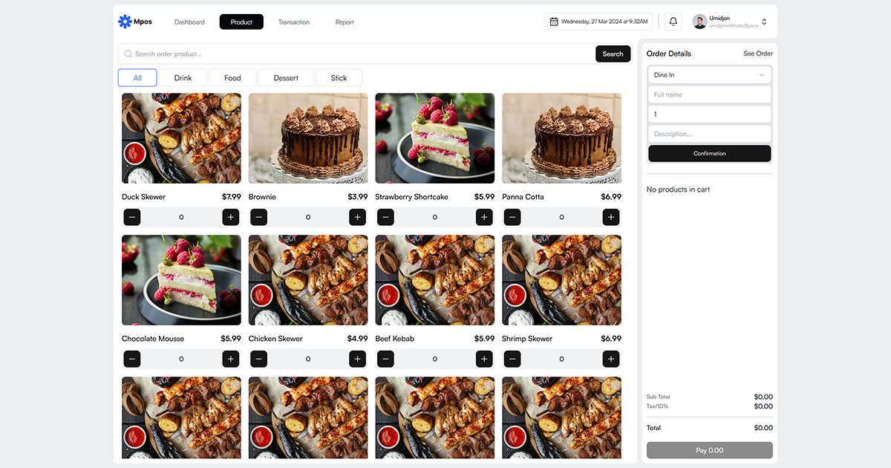

# MPOS (Modern Point of Sale)



MPOS is a modern, scalable Point of Sale system built with Next.js and TypeScript—optimized for businesses seeking a robust, performant, and intuitive POS solution.

## 🛠️ Tech Stack

- **Frontend:** Next.js, React, TypeScript, CSS
- **Backend:** Next.js API routes
- **Other:** Component-based design, rapid delivery focus

## 🚀 Features

- Clean, intuitive, and responsive UI/UX
- High-performance and scalable architecture
- Easily customizable for various retail and restaurant business needs
- Modern codebase using the latest features of TypeScript and React

## 📦 Project Structure

```
.
├── app/                # Main application pages, layouts, loading states, global styles
│   ├── (root)/         # Root-level routes (e.g., dashboard)
│   ├── layout.tsx      # Global layout and metadata
│   ├── loading.tsx     # App loading screen
│   └── globals.css     # Main global CSS (Tailwind, custom themes)
├── public/             # Static files, images, fonts
│   └── fonts/          # Satoshi font files
├── components/         # Reusable React components (UI, features)
│   └── ui/             # UI primitives (form, label, etc.)
├── lib/                # Library utilities (e.g., axios instance, helpers)
│   └── utils.ts        # Utility functions (class names, API clients)
├── stores/             # Zustand stores for state management (auth, UI, products, cart, notifications, transactions)
├── types/              # TypeScript type definitions (cart, user, index, etc.)
├── styles/             # Additional global and component styles
├── tsconfig.json       # TypeScript configuration
├── next.config.js      # Next.js configuration
├── package.json        # Project metadata and dependencies
```

- The OpenGraph image for repo/social previews is located at: `./app/opengraph-image.png`
- Utilities and state management are centralized in `lib/` and `stores/`
- Types are organized in the `types/` directory for strong typing and scalability

For more details, refer to the official repo on [GitHub](https://github.com/umidjonvokhidov/mpos).

## 🖼 OpenGraph Image

This repository includes an `opengraph-image.png` (or similar file) in the root or public directory, used for rich previews on social platforms and as a project thumbnail.

## 🏁 Getting Started

1. **Clone the repository:**
   ```bash
   git clone https://github.com/umidjonvokhidov/mpos.git
   cd mpos
   ```

2. **Install dependencies:**
   ```bash
   npm install
   # or
   yarn install
   ```

3. **Run the development server:**
   ```bash
   npm run dev
   # or
   yarn dev
   ```

4. Visit [http://localhost:3000](http://localhost:3000) to view the app.

## 📄 License

This project is licensed under the MIT License.

## 👤 Author

[Umidjon Vokhidov](https://github.com/umidjonvokhidov)

---

> Pro Developer Tip: To further enhance your repo’s discoverability, consider adding a full project description, setup instructions for production deployments, and screenshots or GIFs demonstrating the workflow. Reference the [Next.js Documentation](https://nextjs.org/docs) for advanced configuration and deployment tips.
